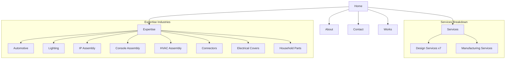
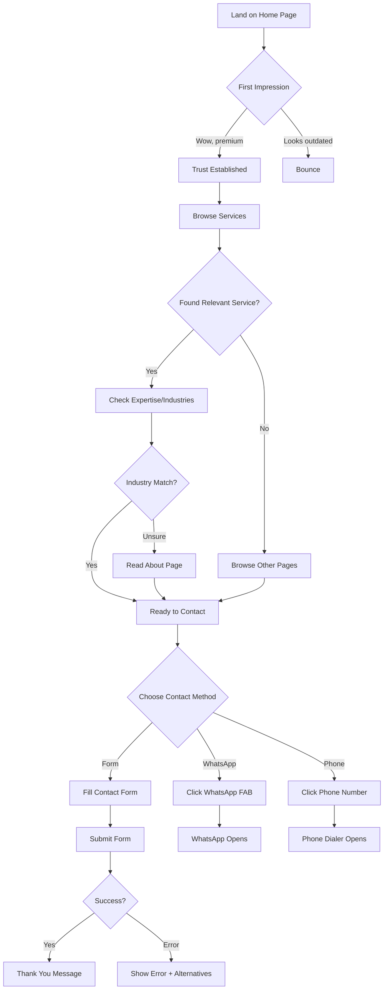
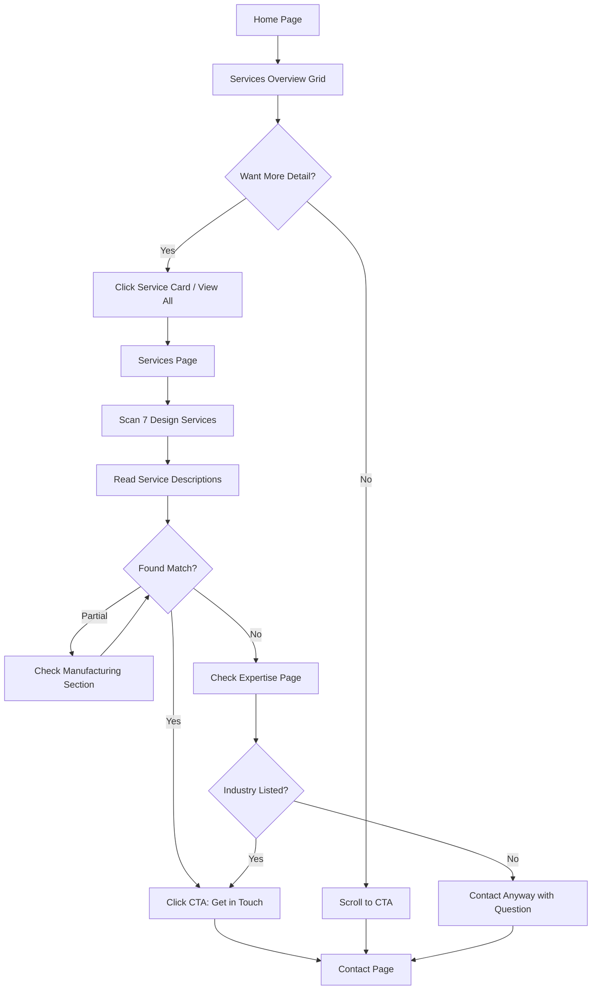
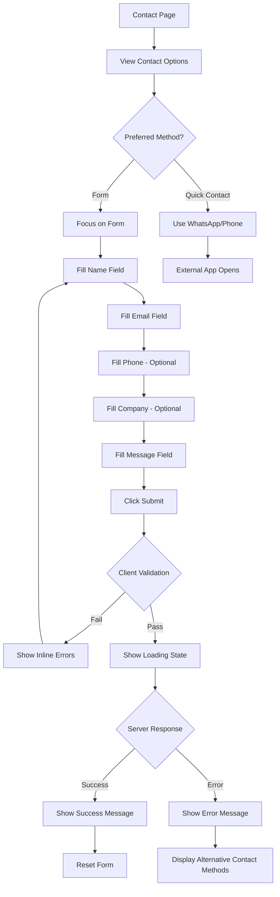

# Molvexa Website — UI/UX Specification

**Version:** 1.0
**Status:** Complete
**Last Updated:** 2026-01-15

---

## 1. Introduction

This document defines the user experience goals, information architecture, user flows, and visual design specifications for Molvexa's user interface. It serves as the foundation for visual design and frontend development, ensuring a cohesive and user-centered experience.

### 1.1 Overall UX Goals & Principles

#### Target User Personas

**1. Manufacturing Decision Maker**
- Technical professionals (engineers, procurement managers) at automotive, lighting, HVAC companies
- Evaluating mold design partners; value precision, reliability, and technical capability
- Likely browsing on desktop during work hours; may revisit on mobile

**2. Small Business Owner / Entrepreneur**
- Needs product tooling for new product launch
- Less technical; prioritizes clarity, trust signals, and easy contact
- May first discover via mobile search

**3. Existing Client / Referral**
- Already knows Molvexa; visiting to confirm services or get contact info
- Wants quick access to phone/WhatsApp; may share link with colleagues

#### Usability Goals

| Goal | Success Criteria |
|------|------------------|
| **Immediate Trust** | Visitors perceive premium quality within 3 seconds of landing |
| **Clear Service Discovery** | Users understand all 7 design services + manufacturing within 2 minutes |
| **Effortless Contact** | Any visitor can initiate contact in ≤3 clicks from any page |
| **Mobile Efficiency** | B2B users on-the-go can call/WhatsApp directly from mobile without friction |
| **Industry Relevance** | Visitors quickly confirm Molvexa serves their industry |

#### Design Principles

1. **Precision is the Message** — Every pixel-perfect detail reinforces Molvexa's engineering excellence
2. **Clarity over Complexity** — Premium means elegant simplicity, not feature overload
3. **Contact Always Accessible** — WhatsApp floating button + header phone ensures zero friction to inquire
4. **White Space is Trust** — Generous spacing signals confidence and quality
5. **Purposeful Motion** — Subtle animations guide attention without distraction

### 1.2 Change Log

| Date | Version | Description | Author |
|------|---------|-------------|--------|
| 2026-01-15 | 1.0 | Initial UI/UX specification | Sally (UX Expert) |

---

## 2. Responsive Design Specifications

### 2.1 Breakpoints

| Breakpoint | Min Width | Target Devices | Tailwind Prefix |
|------------|-----------|----------------|-----------------|
| **Mobile** | 375px | Smartphones | (default) |
| **Tablet** | 768px | Tablets, small laptops | `md:` |
| **Desktop** | 1024px | Laptops, monitors | `lg:` |
| **Wide** | 1280px | Large monitors | `xl:` |

### 2.2 Typography Scale (Responsive)

| Element | Mobile (default) | Tablet (md:) | Desktop (lg:) | CSS Classes |
|---------|------------------|--------------|---------------|-------------|
| **H1 (Hero)** | 32px / 2rem | 48px / 3rem | 64px / 4rem | `text-3xl md:text-5xl lg:text-6xl` |
| **H2 (Section)** | 24px / 1.5rem | 32px / 2rem | 40px / 2.5rem | `text-2xl md:text-3xl lg:text-4xl` |
| **H3 (Subsection)** | 20px / 1.25rem | 24px / 1.5rem | 28px / 1.75rem | `text-xl md:text-2xl lg:text-[1.75rem]` |
| **H4 (Card Title)** | 18px / 1.125rem | 20px / 1.25rem | 20px / 1.25rem | `text-lg md:text-xl` |
| **Body (Large)** | 16px / 1rem | 18px / 1.125rem | 18px / 1.125rem | `text-base md:text-lg` |
| **Body (Default)** | 14px / 0.875rem | 16px / 1rem | 16px / 1rem | `text-sm md:text-base` |
| **Caption/Small** | 12px / 0.75rem | 14px / 0.875rem | 14px / 0.875rem | `text-xs md:text-sm` |

**Line Heights:**

| Element | Line Height | Tailwind Class |
|---------|-------------|----------------|
| Headings | 1.1 - 1.2 | `leading-tight` |
| Body text | 1.6 - 1.75 | `leading-relaxed` |
| Captions | 1.4 | `leading-normal` |

### 2.3 Button Sizes (Responsive)

| Context | Mobile (default) | Tablet+ (md:) | CSS Implementation |
|---------|------------------|---------------|---------------------|
| **Primary CTA (Hero)** | `size="default"` | `size="lg"` | `h-10 px-6 md:h-12 md:px-8 text-sm md:text-base` |
| **Secondary CTA** | `size="default"` | `size="default"` | `h-10 px-4 text-sm` |
| **Card Actions** | `size="sm"` | `size="default"` | `h-8 px-3 md:h-10 md:px-4 text-xs md:text-sm` |
| **Icon Buttons** | `size="icon-sm"` | `size="icon"` | `size-8 md:size-9` |
| **WhatsApp Float** | 48px | 56px | `size-12 md:size-14` |

### 2.4 Touch Target Specifications

| Element | Minimum Size | Recommended | CSS |
|---------|--------------|-------------|-----|
| **Buttons** | 44×44px | 48×48px | `min-h-11 min-w-11` or `min-h-12 min-w-12` |
| **Nav Links** | 44×44px | 48×44px | `py-3 px-4` |
| **Form Inputs** | 44px height | 48px height | `h-11 md:h-12` |
| **Icon Buttons** | 44×44px | 48×48px | `size-11 md:size-12` |
| **WhatsApp FAB** | 48×48px | 56×56px | `size-12 md:size-14` |

### 2.5 Spacing Scale (Responsive)

| Use Case | Mobile | Tablet | Desktop | Classes |
|----------|--------|--------|---------|---------|
| **Section Padding (Y)** | 64px | 96px | 128px | `py-16 md:py-24 lg:py-32` |
| **Section Padding (X)** | 16px | 24px | 32px | `px-4 md:px-6 lg:px-8` |
| **Card Padding** | 16px | 24px | 24px | `p-4 md:p-6` |
| **Component Gap** | 16px | 24px | 32px | `gap-4 md:gap-6 lg:gap-8` |
| **Grid Gap** | 16px | 24px | 32px | `gap-4 md:gap-6 lg:gap-8` |

---

## 3. Information Architecture (IA)

### 3.1 Site Map



### 3.2 Screen Inventory

| Route | Page | Purpose | Priority |
|-------|------|---------|----------|
| `/` | Home | First impression, conversion funnel entry | Critical |
| `/services` | Services | Showcase 7 design + manufacturing capabilities | Critical |
| `/about` | About | Company story, vision, mission, trust-building | High |
| `/expertise` | Expertise | Industry experience validation | High |
| `/contact` | Contact | Lead capture, multiple contact channels | Critical |
| `/works` | Works | Portfolio placeholder (future content) | Medium |

### 3.3 Navigation Structure

**Primary Navigation (Header)**

| Position | Item | Link | Notes |
|----------|------|------|-------|
| 1 | Logo | `/` | Molvexa logo, always links home |
| 2 | Services | `/services` | |
| 3 | About | `/about` | |
| 4 | Expertise | `/expertise` | |
| 5 | Works | `/works` | |
| 6 | Contact | `/contact` | May be styled as CTA button |
| 7 | Phone | `tel:+xxx` | Desktop only, right-aligned |

**Mobile Navigation (Sheet/Drawer)**
- Hamburger trigger (right side of header)
- Full-screen or slide-in drawer
- Same links as desktop, stacked vertically
- Phone number prominent at bottom
- WhatsApp quick-link included

**Footer Navigation**

| Column 1: Company | Column 2: Services | Column 3: Contact |
|-------------------|-------------------|-------------------|
| About | Design Services | Phone |
| Expertise | Manufacturing | Email |
| Works | | WhatsApp |
| | | Location |

### 3.4 Navigation Behavior

| State | Desktop | Mobile |
|-------|---------|--------|
| **Default** | Horizontal nav, all links visible | Hamburger icon only |
| **Scroll** | Sticky header with subtle shadow | Sticky hamburger |
| **Active Page** | Underline or color highlight | Same in drawer |
| **Hover** | Subtle color shift, no dropdowns | N/A |
| **Mobile Open** | N/A | Sheet slides from right, body scroll locked |

---

## 4. User Flows

### 4.1 Primary Conversion Journey

**User Goal:** Evaluate Molvexa and initiate contact

**Entry Points:** Direct URL, search engine, referral link

**Success Criteria:** Visitor submits contact form, calls, or initiates WhatsApp chat



### 4.2 Service Discovery Flow

**User Goal:** Understand what services Molvexa offers



### 4.3 Contact Form Submission Flow

**User Goal:** Send inquiry to Molvexa



### 4.4 Edge Cases & Error Handling

| Scenario | Handling |
|----------|----------|
| Form validation errors | Inline error messages, don't clear fields |
| API failure | Show error with phone/WhatsApp alternatives |
| Slow connection | Loading spinner on submit button |
| WhatsApp not installed | Browser opens wa.me link (web WhatsApp) |
| Rate limiting | "Too many attempts. Please try again in a few minutes." |

---

## 5. Wireframes & Mockups

### 5.1 Home Page Layout

```
┌─────────────────────────────────────────────────────────────┐
│  [Logo]     Services  About  Expertise  Works  Contact  📞  │  ← Header (sticky)
├─────────────────────────────────────────────────────────────┤
│                                                             │
│           Moulding Value with Excellence                    │  ← H1
│                  and Accuracy                               │
│                                                             │
│     Premium mold design, engineering, and manufacturing     │  ← Subtitle
│        services built on precision and excellence.          │
│                                                             │
│         [ Get in Touch ]    [ View Services ]               │  ← CTAs
│                                                             │
├─────────────────────────────────────────────────────────────┤
│                    Our Services                             │  ← Section
│   ┌─────────┐  ┌─────────┐  ┌─────────┐  ┌─────────┐       │
│   │ Service │  │ Service │  │ Service │  │ Service │       │  ← Cards grid
│   │  Card   │  │  Card   │  │  Card   │  │  Card   │       │
│   └─────────┘  └─────────┘  └─────────┘  └─────────┘       │
├─────────────────────────────────────────────────────────────┤
│                 Industries We Serve                         │
│   ┌─────────┐  ┌─────────┐  ┌─────────┐  ┌─────────┐       │  ← Industry badges
│   │Automotive│  │Lighting │  │  HVAC   │  │Connectors│      │
│   └─────────┘  └─────────┘  └─────────┘  └─────────┘       │
├─────────────────────────────────────────────────────────────┤
│                  Why Choose Molvexa?                        │
│   ┌─────────────┐  ┌─────────────┐  ┌─────────────┐        │  ← Brand pillars
│   │   VALUE     │  │ EXCELLENCE  │  │  ACCURACY   │        │
│   └─────────────┘  └─────────────┘  └─────────────┘        │
├─────────────────────────────────────────────────────────────┤
│              Ready to Start Your Project?                   │  ← Final CTA
│                  [ Get in Touch ]                           │
├─────────────────────────────────────────────────────────────┤
│  [Footer]                                                   │
└─────────────────────────────────────────────────────────────┘
                                                          [💬] ← WhatsApp FAB
```

### 5.2 Contact Page Layout

```
Desktop (Two-Column):
┌────────────────────────────┬────────────────────────────────┐
│    Contact Form            │    Contact Information         │
│   ┌──────────────────┐    │    📞 Phone                    │
│   │ Full Name *      │    │    +91 XXXXX XXXXX             │
│   └──────────────────┘    │                                │
│   ┌──────────────────┐    │    ✉️ Email                    │
│   │ Email Address *  │    │    contact@molvexa.com         │
│   └──────────────────┘    │                                │
│   ┌──────────────────┐    │    💬 WhatsApp                  │
│   │ Phone (optional) │    │    [ Open WhatsApp ]            │
│   └──────────────────┘    │                                │
│   ┌──────────────────┐    │    📍 Location                  │
│   │ Company (opt.)   │    │    [City, Country]              │
│   └──────────────────┘    │                                │
│   ┌──────────────────┐    │                                │
│   │ Your Message *   │    │                                │
│   └──────────────────┘    │                                │
│   [ Send Message ]         │                                │
└────────────────────────────┴────────────────────────────────┘

Mobile (Stacked - Contact Info First):
┌─────────────────────┐
│  Contact Info       │  ← Shows first on mobile
│  Phone | WhatsApp   │
├─────────────────────┤
│  Contact Form       │
│  [Fields...]        │
│  [ Send Message ]   │
└─────────────────────┘
```

---

## 6. Component Library / Design System

### 6.1 Design System Approach

**Framework:** shadcn/ui v3.5.0 (New York style) + Custom components built on Radix UI primitives

### 6.2 Core shadcn/ui Components

| Component | Usage | Install Command |
|-----------|-------|-----------------|
| `Button` | CTAs, form submit, nav actions | `npx shadcn add button` |
| `Card` | Service cards, industry cards | `npx shadcn add card` |
| `Input` | Form text fields | `npx shadcn add input` |
| `Textarea` | Message field | `npx shadcn add textarea` |
| `Sheet` | Mobile navigation drawer | `npx shadcn add sheet` |
| `Label` | Form field labels | `npx shadcn add label` |

### 6.3 Custom Components

#### Section
```tsx
interface SectionProps {
  children: React.ReactNode;
  className?: string;
  id?: string;
  fullWidth?: boolean;
}
// Styling: "py-16 md:py-24 lg:py-32 px-4 md:px-6 lg:px-8"
// Inner container: "mx-auto max-w-6xl"
```

#### SectionHeader
```tsx
interface SectionHeaderProps {
  title: string;
  subtitle?: string;
  centered?: boolean; // default: true
}
// Title: "text-2xl md:text-3xl lg:text-4xl font-semibold text-primary"
// Subtitle: "mt-4 text-base md:text-lg text-text-secondary max-w-2xl"
```

#### ServiceCard
```tsx
interface ServiceCardProps {
  service: {
    id: string;
    title: string;
    description: string;
    icon: string;
  };
  variant?: 'compact' | 'expanded';
  index?: number;
}
// Hover: translateY(-2px) + shadow-card-hover
```

#### IndustryCard
```tsx
interface IndustryCardProps {
  industry: {
    id: string;
    name: string;
    description?: string;
    icon: string;
  };
  variant?: 'badge' | 'card';
  index?: number;
}
```

#### ContactForm
```tsx
interface ContactFormProps {
  onSuccess?: () => void;
}
// States: Idle, Loading, Success, Error
```

#### WhatsAppButton (FAB)
```tsx
interface WhatsAppButtonProps {
  phoneNumber: string;
  message?: string;
}
// Position: "fixed bottom-6 right-6 z-50"
// Size: "size-12 md:size-14"
// Color: WhatsApp green (#25D366)
```

#### AnimatedElement
```tsx
interface AnimatedElementProps {
  children: React.ReactNode;
  variant?: 'fadeIn' | 'fadeInUp' | 'fadeInLeft' | 'fadeInRight';
  delay?: number;
  duration?: number;
  className?: string;
}
```

---

## 7. Branding & Style Guide

### 7.1 Visual Identity

| Element | Specification |
|---------|---------------|
| **Logo** | Geometric "M" with metallic blue gradient on navy background |
| **Tagline** | "Moulding Value with Excellence and Accuracy" |
| **Brand Pillars** | Value, Excellence, Accuracy |

### 7.2 Color Palette

| Color Type | Name | Hex Code | CSS Variable | Usage |
|------------|------|----------|--------------|-------|
| **Primary** | Navy Blue | `#1a2744` | `--color-primary` | Headings, buttons, logo |
| **Primary Light** | Navy Light | `#2d3a52` | `--color-primary-light` | Hover states |
| **Primary Dark** | Navy Dark | `#0f1829` | `--color-primary-dark` | Footer background |
| **Accent** | Metallic Blue | `#3d6b8a` | `--color-accent` | Gradient accents, links |
| **Background** | Off-White | `#fafafa` | `--color-background` | Page background |
| **Background White** | Pure White | `#ffffff` | `--color-background-white` | Cards, inputs |
| **Background Muted** | Light Gray | `#f4f4f5` | `--color-background-muted` | Section alternates |
| **Text Primary** | Navy | `#1a2744` | `--color-text-primary` | Headings, body text |
| **Text Secondary** | Gray | `#52525b` | `--color-text-secondary` | Subtitles, descriptions |
| **Text Muted** | Light Gray | `#a1a1aa` | `--color-text-muted` | Placeholders |
| **Border** | | `#e4e4e7` | `--color-border` | Card borders, dividers |
| **Success** | Green | `#22c55e` | `--color-success` | Success messages |
| **Error** | Red | `#ef4444` | `--color-error` | Error messages |
| **WhatsApp** | WhatsApp Green | `#25d366` | `--color-whatsapp` | WhatsApp FAB |

### 7.3 Typography

**Font Family:** Geist (via `next/font`)

| Element | Mobile | Tablet+ | Weight | Line Height | Tailwind Classes |
|---------|--------|---------|--------|-------------|------------------|
| **H1** | 30px | 48-64px | 600 | 1.1 | `text-3xl md:text-5xl lg:text-6xl font-semibold leading-tight` |
| **H2** | 24px | 32-40px | 600 | 1.2 | `text-2xl md:text-3xl lg:text-4xl font-semibold leading-tight` |
| **H3** | 20px | 24-28px | 600 | 1.2 | `text-xl md:text-2xl font-semibold leading-tight` |
| **H4** | 18px | 20px | 500 | 1.3 | `text-lg md:text-xl font-medium` |
| **Body Large** | 16px | 18px | 400 | 1.6 | `text-base md:text-lg leading-relaxed` |
| **Body** | 14px | 16px | 400 | 1.6 | `text-sm md:text-base leading-relaxed` |
| **Caption** | 12px | 14px | 400 | 1.4 | `text-xs md:text-sm` |

### 7.4 Iconography

**Icon Library:** Lucide React

| Context | Size | Tailwind Class |
|---------|------|----------------|
| **Inline with text** | 16px | `size-4` |
| **Button icons** | 16-20px | `size-4` or `size-5` |
| **Card icons** | 24px | `size-6` |
| **Feature icons** | 32px | `size-8` |
| **Hero icons** | 40-48px | `size-10` or `size-12` |

### 7.5 Shadows & Elevation

| Level | Name | CSS Value | Usage |
|-------|------|-----------|-------|
| **1** | Subtle | `0 1px 2px rgba(0,0,0,0.05)` | Inputs |
| **2** | Card | `0 1px 3px rgba(0,0,0,0.08)` | Cards default |
| **3** | Card Hover | `0 4px 12px rgba(0,0,0,0.1)` | Cards on hover |
| **4** | Elevated | `0 10px 25px rgba(0,0,0,0.1)` | Modals |
| **5** | FAB | `0 4px 14px rgba(0,0,0,0.15)` | WhatsApp button |

### 7.6 Border Radius

| Token | Value | Tailwind | Usage |
|-------|-------|----------|-------|
| `sm` | 6px | `rounded-md` | Inputs, small buttons |
| `md` | 8px | `rounded-lg` | Cards, standard buttons |
| `lg` | 12px | `rounded-xl` | Large cards, modals |
| `full` | 9999px | `rounded-full` | Badges, FAB |

---

## 8. Accessibility Requirements

### 8.1 Compliance Target

**Standard:** WCAG 2.1 Level AA

### 8.2 Visual Requirements

| Requirement | Specification | Implementation |
|-------------|---------------|----------------|
| **Color Contrast (Text)** | Minimum 4.5:1 | Navy on white = 12.6:1 ✅ |
| **Focus Indicators** | Visible focus ring | `ring-2 ring-primary/50 ring-offset-2` |
| **Text Resizing** | Readable at 200% zoom | Use `rem`/`em` units |
| **Color Independence** | Not conveyed by color alone | Icons + text labels |

### 8.3 Interaction Requirements

| Requirement | Implementation |
|-------------|----------------|
| **Keyboard Navigation** | Tab order follows visual flow |
| **Skip Links** | Hidden until focused, first focusable element |
| **Touch Targets** | Minimum 44×44px |
| **Motion** | Respect `prefers-reduced-motion` |

### 8.4 Content Requirements

| Requirement | Implementation |
|-------------|----------------|
| **Alt Text** | Descriptive alt for meaningful images |
| **Heading Structure** | Single h1 per page, sequential levels |
| **Form Labels** | All inputs have associated labels |
| **Error Identification** | Inline error messages with icons |
| **Language** | `<html lang="en">` |

### 8.5 Screen Reader Support

- Use semantic landmarks: `<header>`, `<main>`, `<footer>`, `<nav>`
- Icon buttons have `aria-label`
- Form success/error use `role="alert"`
- Current page nav link uses `aria-current="page"`

### 8.6 Testing Strategy

| Test Type | Tool | Frequency |
|-----------|------|-----------|
| **Automated** | axe DevTools | Every PR |
| **Automated** | Lighthouse Accessibility | Every build |
| **Manual** | Keyboard navigation | Before launch |
| **Manual** | Screen reader | Before launch |

---

## 9. Animation & Micro-interactions

### 9.1 Motion Principles

| Principle | Description |
|-----------|-------------|
| **Purposeful** | Every animation serves a function |
| **Subtle** | Small movements (2-4px), short durations |
| **Consistent** | Same patterns throughout |
| **Performant** | 60fps, transform/opacity only |
| **Respectful** | Honor `prefers-reduced-motion` |

### 9.2 Animation Tokens

```typescript
export const animation = {
  duration: {
    fast: 0.15,
    normal: 0.2,
    slow: 0.3,
    slower: 0.5,
  },
  ease: {
    default: [0.4, 0, 0.2, 1],
    out: [0, 0, 0.2, 1],
    bounce: [0.34, 1.56, 0.64, 1],
  },
  stagger: 0.1,
} as const;
```

### 9.3 Key Animations

| Element | Animation | Duration | Delay | Easing |
|---------|-----------|----------|-------|--------|
| **Hero H1** | fadeInUp | 0.5s | 0.2s | ease-out |
| **Hero subtitle** | fadeInUp | 0.5s | 0.4s | ease-out |
| **Hero buttons** | fadeInUp | 0.5s | 0.6s | ease-out |
| **Section headers** | fadeInUp | 0.5s | 0s | ease-out |
| **Card grid items** | fadeInUp | 0.5s | index × 0.1s | ease-out |
| **Card hover** | translateY(-4px) | 0.2s | 0s | ease-out |
| **Button hover** | scale(1.02) | 0.15s | 0s | ease-out |
| **Button tap** | scale(0.98) | 0.15s | 0s | ease-out |
| **WhatsApp FAB** | fadeInUp + scale | 0.5s | 1s | bounce |
| **Mobile menu** | slideInRight | 0.3s | 0s | ease-out |
| **Form success** | fadeInDown | 0.3s | 0s | ease-out |
| **Header scroll** | background + shadow | 0.2s | 0s | ease |

### 9.4 Reduced Motion Support

```tsx
const reducedMotion = useReducedMotion();

<motion.div
  initial={reducedMotion ? false : { opacity: 0, y: 20 }}
  whileInView={reducedMotion ? {} : { opacity: 1, y: 0 }}
  transition={reducedMotion ? { duration: 0 } : { duration: 0.5 }}
>
```

---

## 10. Performance Considerations

### 10.1 Performance Goals

| Metric | Target |
|--------|--------|
| **Lighthouse Performance** | ≥ 90 |
| **First Contentful Paint (FCP)** | < 1.5s |
| **Largest Contentful Paint (LCP)** | < 2.5s |
| **Cumulative Layout Shift (CLS)** | < 0.1 |
| **Time to Interactive (TTI)** | < 3s |
| **Initial JS Bundle** | < 100KB |

### 10.2 Design Strategies

| Strategy | Implementation |
|----------|----------------|
| **Optimized Images** | Next.js `<Image>` with WebP/AVIF |
| **Font Loading** | `next/font` with `display: swap` |
| **Minimal Animations** | Transform/opacity only |
| **Code Splitting** | Automatic per-route |
| **Static Generation** | Pre-rendered at build time |

### 10.3 Bundle Size Budget

| Category | Budget |
|----------|--------|
| Framework (Next.js/React) | ~45KB |
| UI Components (shadcn/ui) | ~15KB |
| Animation (Motion) | ~20KB |
| Icons (Lucide) | ~5KB |
| Fonts (Geist) | ~20KB |
| Application Code | ~15KB |
| **Total Initial** | < 120KB |

---

## 11. Next Steps

### 11.1 Immediate Actions

1. Review this specification with stakeholders for sign-off
2. Confirm content assets — logo SVG, service descriptions, contact details
3. Set up development environment — Next.js 16, pnpm, shadcn/ui
4. Begin Epic 1 implementation — Start with Story 1.1 (Foundation)
5. Create component library — Build Section, ServiceCard, etc. per specs

### 11.2 Open Questions

| Question | Owner | Priority |
|----------|-------|----------|
| Final WhatsApp business number? | Business | High |
| Final contact email recipient? | Business | High |
| Logo SVG file available? | Business | High |
| Analytics approach (Vercel/GA4/none)? | Business | Medium |

---

## 12. Design Handoff Checklist

| Item | Status |
|------|--------|
| ✅ All user flows documented | Complete |
| ✅ Component inventory complete | Complete |
| ✅ Accessibility requirements defined | Complete |
| ✅ Responsive strategy clear | Complete |
| ✅ Brand guidelines incorporated | Complete |
| ✅ Performance goals established | Complete |
| ✅ Animation specifications defined | Complete |
| ✅ Typography scale documented | Complete |
| ✅ Color palette with contrast validation | Complete |
| ✅ Touch target sizes specified | Complete |

### Final Validation

| Metric | Assessment |
|--------|------------|
| **Overall Spec Completeness** | **100%** |
| **Ready for Development** | **Yes** |
| **Alignment with PRD** | **Full** |

---

*Generated with BMAD Method*
